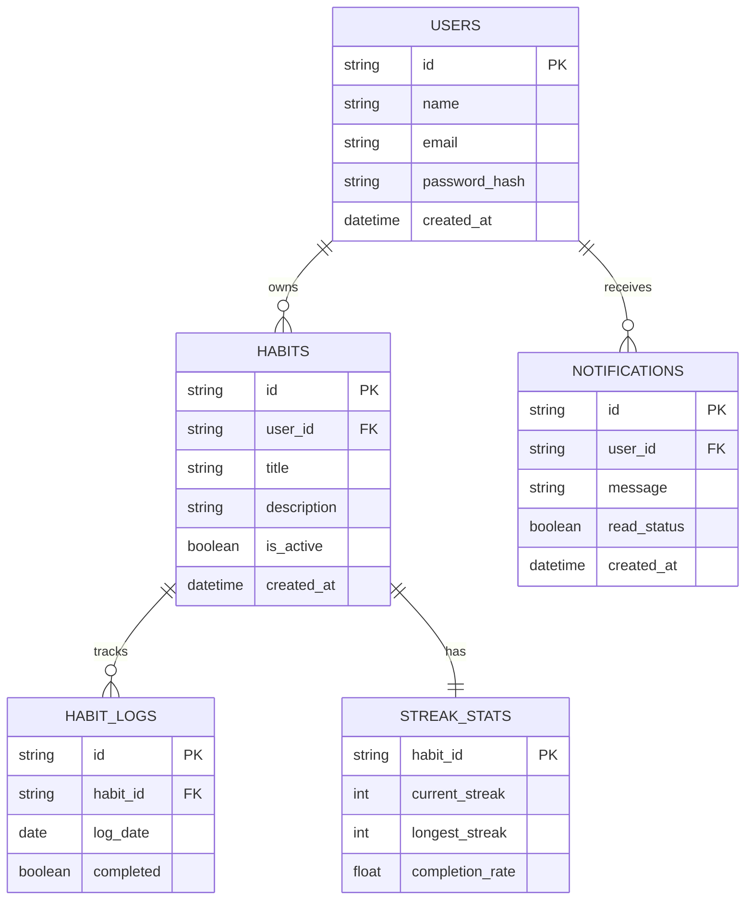

```mermaid
erDiagram

USERS {
    string id PK
    string name
    string email
    string password_hash
    datetime created_at
}

HABITS {
    string id PK
    string user_id FK
    string title
    string description
    boolean is_active
    datetime created_at
}

HABIT_LOGS {
    string id PK
    string habit_id FK
    date log_date
    boolean completed
}

STREAK_STATS {
    string habit_id PK
    int current_streak
    int longest_streak
    float completion_rate
}

NOTIFICATIONS {
    string id PK
    string user_id FK
    string message
    boolean read_status
    datetime created_at
}

USERS ||--o{ HABITS : owns
HABITS ||--o{ HABIT_LOGS : tracks
HABITS ||--|| STREAK_STATS : has
USERS ||--o{ NOTIFICATIONS : receives
```
