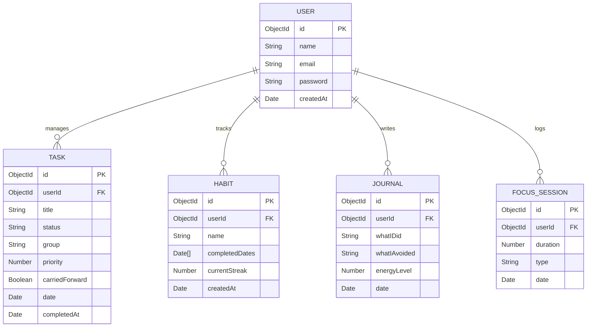

# Entity Relationship Diagram

```mermaid
erDiagram
    USER ||--o{ TASK : manages
    USER ||--o{ HABIT : tracks
    USER ||--o{ JOURNAL : writes
    USER ||--o{ FOCUS_SESSION : logs

    USER {
        ObjectId id PK
        String name
        String email
        String password
        Date createdAt
    }

    TASK {
        ObjectId id PK
        ObjectId userId FK
        String title
        String status
        String group
        Number priority
        Boolean carriedForward
        Date date
        Date completedAt
    }

    HABIT {
        ObjectId id PK
        ObjectId userId FK
        String name
        Date[] completedDates
        Number currentStreak
        Date createdAt
    }

    JOURNAL {
        ObjectId id PK
        ObjectId userId FK
        String whatIDid
        String whatIAvoided
        Number energyLevel
        Date date
    }

    FOCUS_SESSION {
        ObjectId id PK
        ObjectId userId FK
        Number duration
        String type
        Date date
    }
```
