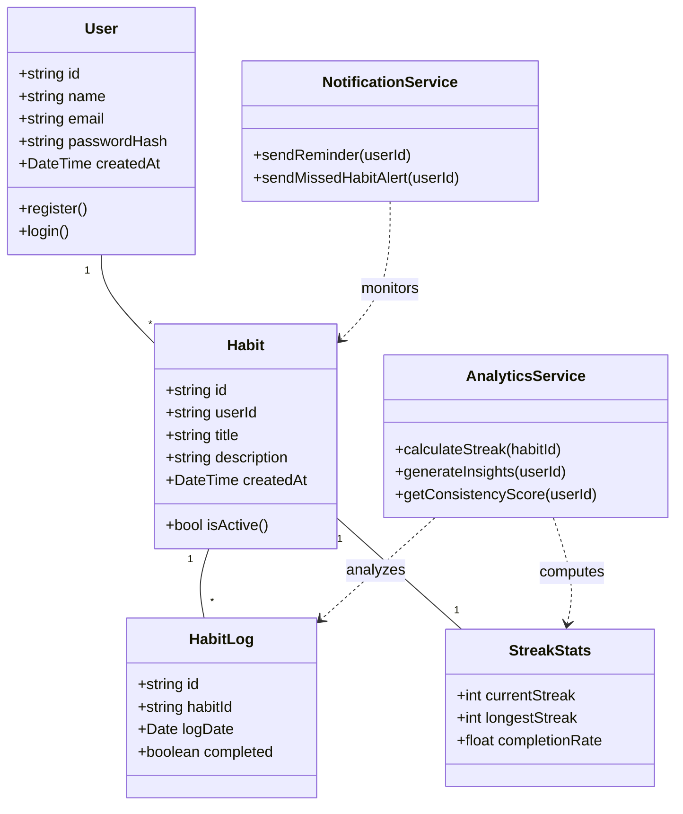

```mermaid
classDiagram

class User {
    +string id
    +string name
    +string email
    +string passwordHash
    +DateTime createdAt
    +register()
    +login()
}

class Habit {
    +string id
    +string userId
    +string title
    +string description
    +DateTime createdAt
    +bool isActive()
}

class HabitLog {
    +string id
    +string habitId
    +Date logDate
    +boolean completed
}

class StreakStats {
    +int currentStreak
    +int longestStreak
    +float completionRate
}

class AnalyticsService {
    +calculateStreak(habitId)
    +generateInsights(userId)
    +getConsistencyScore(userId)
}

class NotificationService {
    +sendReminder(userId)
    +sendMissedHabitAlert(userId)
}

User "1" -- "*" Habit
Habit "1" -- "*" HabitLog
Habit "1" -- "1" StreakStats
AnalyticsService ..> HabitLog : analyzes
AnalyticsService ..> StreakStats : computes
NotificationService ..> Habit : monitors
```
