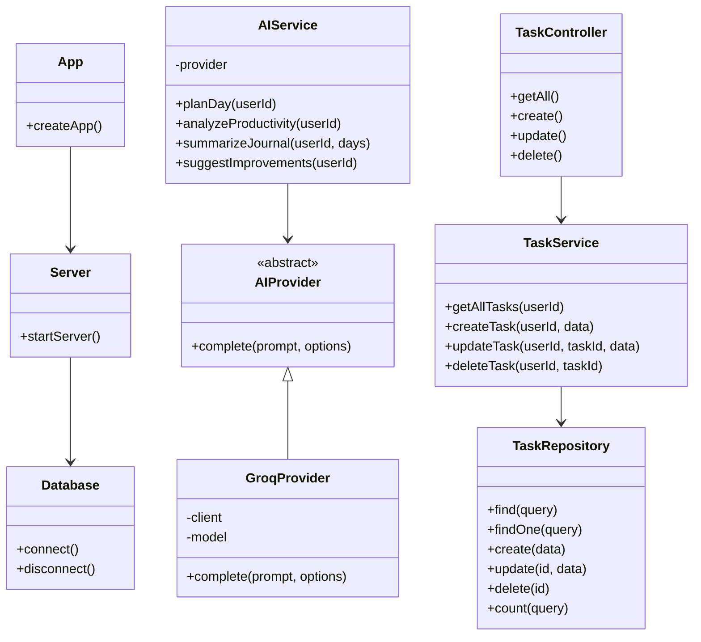

# Class Diagram

```mermaid
classDiagram
    class App {
        +createApp()
    }
    class Server {
        +startServer()
    }
    class Database {
        +connect()
        +disconnect()
    }
    
    class AIProvider {
        <<abstract>>
        +complete(prompt, options)
    }
    class GroqProvider {
        -client
        -model
        +complete(prompt, options)
    }
    
    class AIService {
        -provider
        +planDay(userId)
        +analyzeProductivity(userId)
        +summarizeJournal(userId, days)
        +suggestImprovements(userId)
    }
    
    class TaskService {
        +getAllTasks(userId)
        +createTask(userId, data)
        +updateTask(userId, taskId, data)
        +deleteTask(userId, taskId)
    }
    
    class TaskRepository {
        +find(query)
        +findOne(query)
        +create(data)
        +update(id, data)
        +delete(id)
        +count(query)
    }
    
    class TaskController {
        +getAll()
        +create()
        +update()
        +delete()
    }

    App --> Server
    Server --> Database
    AIProvider <|-- GroqProvider
    AIService --> AIProvider
    TaskController --> TaskService
    TaskService --> TaskRepository
```
