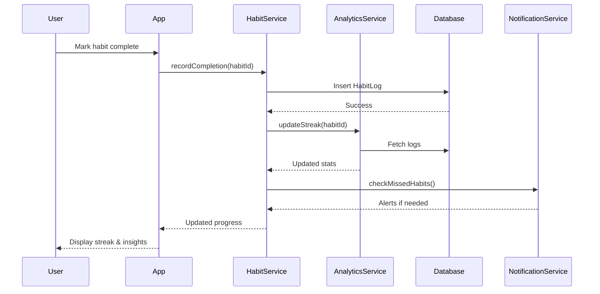

```mermaid
sequenceDiagram
    participant User
    participant App
    participant HabitService
    participant AnalyticsService
    participant Database
    participant NotificationService

    User->>App: Mark habit complete
    App->>HabitService: recordCompletion(habitId)
    HabitService->>Database: Insert HabitLog
    Database-->>HabitService: Success

    HabitService->>AnalyticsService: updateStreak(habitId)
    AnalyticsService->>Database: Fetch logs
    AnalyticsService-->>HabitService: Updated stats

    HabitService->>NotificationService: checkMissedHabits()
    NotificationService-->>HabitService: Alerts if needed

    HabitService-->>App: Updated progress
    App-->>User: Display streak & insights
```
