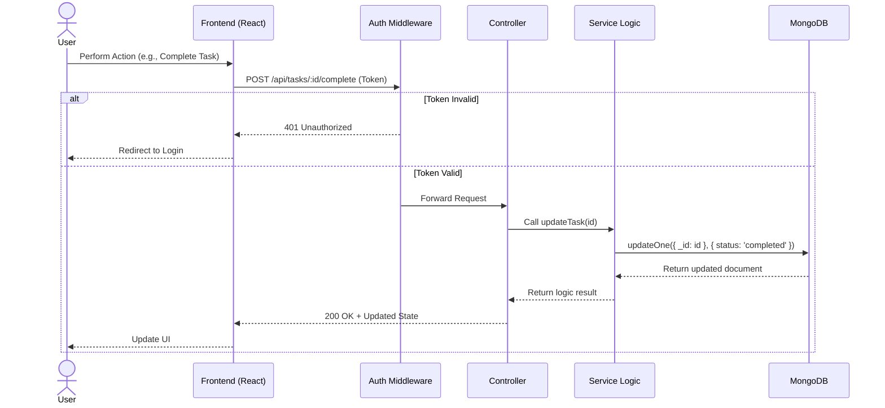

# Sequence Diagram

```mermaid
sequenceDiagram
    actor User
    participant Frontend as Frontend (React)
    participant AuthLayer as Auth Middleware
    participant Controller as Controller
    participant Service as Service Logic
    participant DB as MongoDB
    
    User->>Frontend: Perform Action (e.g., Complete Task)
    Frontend->>AuthLayer: POST /api/tasks/:id/complete (Token)
    
    alt Token Invalid
        AuthLayer-->>Frontend: 401 Unauthorized
        Frontend-->>User: Redirect to Login
    else Token Valid
        AuthLayer->>Controller: Forward Request
        Controller->>Service: Call updateTask(id)
        Service->>DB: updateOne({ _id: id }, { status: 'completed' })
        DB-->>Service: Return updated document
        Service-->>Controller: Return logic result
        Controller-->>Frontend: 200 OK + Updated State
        Frontend-->>User: Update UI
    end
```
