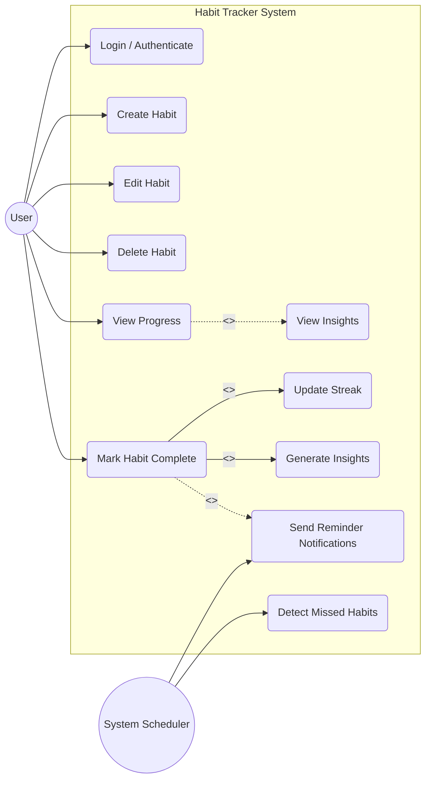

```mermaid
flowchart LR

%% ===== System Boundary =====
subgraph "Habit Tracker System"

UC1(Login / Authenticate)
UC2(Create Habit)
UC3(Edit Habit)
UC4(Delete Habit)
UC5(Mark Habit Complete)
UC6(View Progress)
UC7(View Insights)
UC8(Update Streak)
UC9(Generate Insights)
UC10(Send Reminder Notifications)
UC11(Detect Missed Habits)

%% ===== INCLUDE (mandatory) =====
UC5 -->|<<include>>| UC8
UC5 -->|<<include>>| UC9

%% ===== EXTEND (optional) =====
UC6 -.->|<<extend>>| UC7
UC5 -.->|<<extend>>| UC10

end

%% ===== Actors =====
User((User))
Scheduler((System Scheduler))

User --> UC1
User --> UC2
User --> UC3
User --> UC4
User --> UC5
User --> UC6

Scheduler --> UC10
Scheduler --> UC11
```
