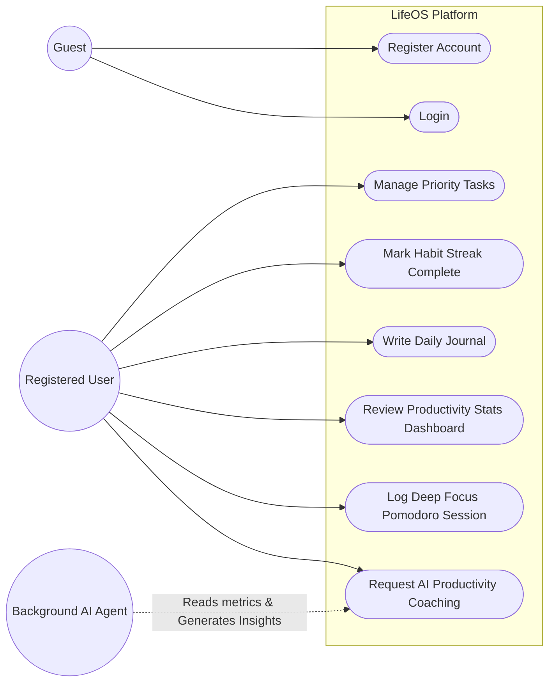

# System Use Case Diagram

```mermaid
flowchart LR
    %% Actors
    guest((Guest))
    user((Registered User))
    ai_engine((Background AI Agent))
    
    %% Boundary
    subgraph LifeOS Platform
        UC1([Register Account])
        UC2([Login])
        UC3([Manage Priority Tasks])
        UC4([Mark Habit Streak Complete])
        UC5([Write Daily Journal])
        UC6([Review Productivity Stats Dashboard])
        UC7([Log Deep Focus Pomodoro Session])
        UC8([Request AI Productivity Coaching])
    end
    
    %% Relationships
    guest --> UC1
    guest --> UC2
    
    user --> UC3
    user --> UC4
    user --> UC5
    user --> UC6
    user --> UC7
    user --> UC8
    
    ai_engine -.->|Reads metrics & Generates Insights| UC8
```
